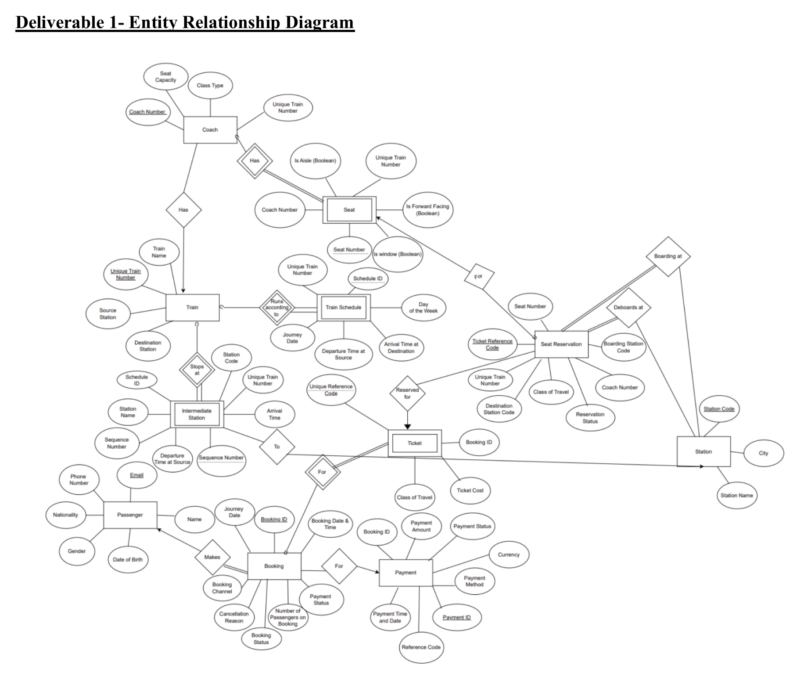

# Railway Reservation Database

Relational database design project for a **Railway Reservation System**, developed as part of an MSc Data Science Database Systems module.

The project covers the database design process from conceptual modelling and relational schema development through to normalisation, performance considerations and SQL querying.

---

## Project Overview

The aim of this project was to design a relational database capable of representing the core operations of a railway reservation system.

The project follows the database development process:

**Entity Relationship Modelling → Relational Schema Design → Functional Dependency Analysis → BCNF Normalisation → Performance Analysis → SQL Queries**

The resulting design represents trains, stations, schedules, coaches, seats, passengers, bookings, tickets, reservations and payments while maintaining relationships between the different components of the reservation system.

---

## Entity Relationship Modelling



An Entity Relationship Diagram (ERD) was developed to define the structure of the Railway Reservation System before translating it into a relational schema.

The design models relationships including:

- trains and their source and destination stations;
- coaches belonging to trains;
- seats belonging to individual coaches;
- scheduled train services;
- intermediate stations along a route;
- passenger bookings;
- tickets associated with bookings;
- seat reservations;
- boarding and destination stations; and
- payments associated with bookings.

The complete ERD and original design rationale are available in the coursework report.

---

## Database Design

The database contains 11 main entities:

- `TRAIN`
- `STATION`
- `COACH`
- `SEAT`
- `TRAIN SCHEDULE`
- `INTERMEDIATE STATION`
- `PASSENGER`
- `BOOKING`
- `TICKET`
- `SEAT RESERVATION`
- `PAYMENT`

Both strong and weak entities were used where appropriate.

Entities such as `TRAIN`, `STATION`, `PASSENGER`, `BOOKING` and `PAYMENT` can be independently identified, while entities such as `SEAT`, `TRAIN SCHEDULE` and `TICKET` depend on identifying information from related entities.

---

## Relational Schema

A SQL implementation of the relational design is provided in:

```text
sql/schema.sql
```

The schema demonstrates:

- primary keys;
- foreign keys;
- composite keys;
- strong and weak entities;
- referential integrity;
- domain constraints;
- `CHECK` constraints;
- `UNIQUE` constraints; and
- database indexes.

Examples of integrity rules represented in the schema include:

- source and destination stations cannot be identical;
- seat numbers and schedule identifiers must be positive;
- coach and ticket classes are restricted to valid travel classes;
- payments must reference valid bookings;
- seat reservations must reference valid tickets and seats;
- boarding and destination stations cannot be identical; and
- intermediate stations belong to a specific scheduled train service.

The GitHub SQL schema is a portfolio implementation based on the coursework ERD, relational design and normalisation analysis.

---

## Database Normalisation

Functional dependencies were identified for each entity and the relational design was evaluated against **Boyce-Codd Normal Form (BCNF)**.

The analysis considered whether every determinant was a candidate key and whether the design introduced:

- partial dependencies;
- transitive dependencies;
- non-key determinants; or
- unnecessary data redundancy.

For example, station information is maintained within the authoritative `STATION` relation rather than being repeatedly stored within route records.

This helps reduce duplication and minimise insertion, deletion and update anomalies.

---

## SQL Queries

The repository contains six SQL queries based on the relational database design.

They are available in:

```text
sql/queries.sql
```

### Query 1 — Second-Class Seat Bookings

Determines the number of **Second-class seats booked between Loughborough and London on a specified date**.

Demonstrates:

- multiple joins;
- subqueries;
- route sequencing;
- filtering;
- aggregation; and
- grouping.

---

### Query 2 — Evening Train Services

Finds trains travelling between **Loughborough and London** that depart Loughborough between **18:00 and 21:00**.

Demonstrates:

- joins;
- intermediate-station filtering;
- time filtering;
- route validation; and
- schedule-level querying.

---

### Query 3 — First-Class Services

Finds trains between Loughborough and London during the specified departure period that contain **First-class coaches**.

Demonstrates:

- `EXISTS`;
- nested queries;
- relational joins;
- class-based filtering; and
- route validation.

---

### Query 4 — Ticket Bookings by Class and Year

Calculates the number of **First-class and Second-class tickets booked for each train by year**.

Demonstrates:

- `LEFT JOIN`;
- conditional aggregation;
- `CASE`;
- `COUNT`;
- `GROUP BY`; and
- date extraction.

---

### Query 5 — Highest Revenue Train

Determines the train that has generated the **highest total ticket sales**.

Demonstrates:

- Common Table Expressions (`WITH`);
- `SUM`;
- aggregation;
- sorting;
- station joins; and
- revenue analysis.

---

### Query 6 — Tickets by Service Time

Calculates the number of tickets booked by service time for trains travelling between **Sheffield and Loughborough during 2025**.

Demonstrates:

- route sequencing;
- schedule-level joins;
- date filtering;
- aggregation;
- service-time analysis; and
- multiple table joins.

---

## Performance and Scalability

The coursework also considered how the database design could operate within a larger production railway reservation system.

### Indexing

Indexes were proposed for frequently searched and joined attributes including:

- train numbers;
- station codes;
- journey dates;
- booking information;
- payment status;
- reservation information; and
- foreign-key columns.

Several of these indexes are implemented in `sql/schema.sql`.

### Partitioning

For high-volume transactional tables such as:

- `BOOKING`
- `TICKET`
- `SEAT RESERVATION`
- `PAYMENT`

horizontal partitioning by attributes such as journey date or booking identifier could be considered in a larger production environment.

### Concurrency

A live railway reservation system may receive many simultaneous requests for the same services and seats.

Potential approaches considered include:

- optimistic or pessimistic locking;
- unique seat constraints;
- workload management; and
- database queues during periods of high demand.

These techniques could help reduce conflicting reservations and minimise the risk of double booking.

---

## Repository Structure

```text
railway-reservation-database/
│
├── README.md
├── Database Systems Coursework.pdf
│
├── figures/
│   └── railway_reservation_erd.png
│
└── sql/
    ├── schema.sql
    └── queries.sql
```

---

## Files

### `sql/schema.sql`

Portfolio SQL implementation of the relational database design.

Includes:

- table definitions;
- primary keys;
- foreign keys;
- composite keys;
- integrity constraints; and
- indexes.

### `sql/queries.sql`

Collection of six analytical and operational SQL queries developed around the railway reservation database.

### `figures/railway_reservation_erd.png`

Entity Relationship Diagram extracted from the original coursework report.

### `Database Systems Coursework.pdf`

The original academic report containing the full database design and analysis, including:

- Entity Relationship Modelling;
- relational schema design;
- strong and weak entity analysis;
- constraints;
- indexing and performance considerations;
- functional dependencies;
- BCNF normalisation;
- SQL query development; and
- proposed future enhancements.

---

## SQL Techniques Demonstrated

This project demonstrates the use of:

- relational database design;
- Entity Relationship Modelling;
- primary and foreign keys;
- composite keys;
- referential integrity;
- functional dependencies;
- BCNF normalisation;
- SQL joins;
- subqueries;
- Common Table Expressions;
- `EXISTS`;
- aggregate functions;
- conditional aggregation;
- `GROUP BY`;
- `ORDER BY`;
- date and time filtering;
- indexes; and
- database constraints.

---

## Future Enhancements

The database could be extended to support additional functionality associated with a production railway reservation platform, including:

- service-capacity management;
- dynamic pricing;
- promotions;
- disruption management;
- exception timetables;
- customer notifications;
- enhanced seat-availability management;
- additional security controls;
- partitioning for large transactional tables; and
- concurrency controls for high-demand booking periods.

These additions would allow the core relational design to support a larger and more operationally complex reservation system.

---

## Skills Demonstrated

This project demonstrates experience in:

- SQL;
- relational database design;
- data modelling;
- Entity Relationship Modelling;
- database normalisation;
- BCNF;
- functional dependency analysis;
- schema design;
- database constraints;
- indexing strategies;
- query design;
- database performance analysis;
- analytical SQL; and
- translating business requirements into a relational data model.

---

## Academic Context

This repository contains work completed as part of an **MSc Data Science Database Systems module**.

The original coursework report has been retained alongside a portfolio implementation of the SQL schema and queries.

The project has been included in my data science portfolio to demonstrate SQL, database design, data modelling and relational database skills.

---

## Author

**Gabriella Davis**

MSc Data Science

GitHub: `gabriella-davis0505`
